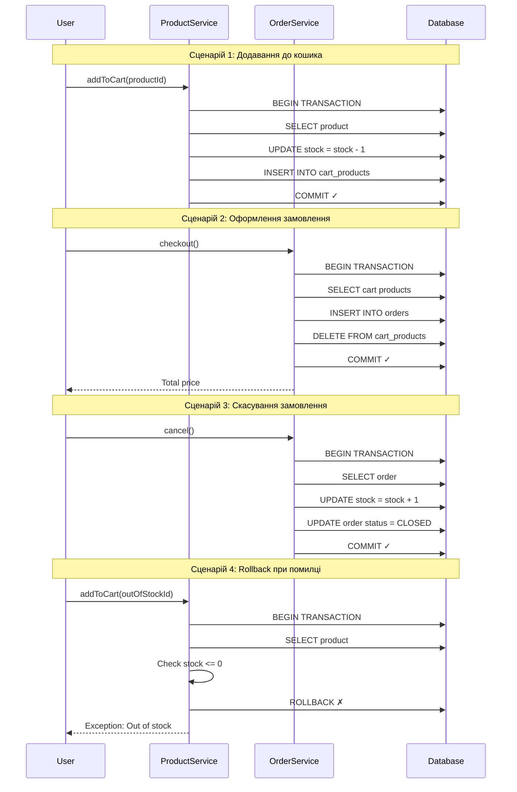

# Transaction Foundations

Демонстраційний проєкт для вивчення **транзакційного патерну** в Spring Boot з JPA/Hibernate.

## Про проєкт

Цей проєкт ілюструє роботу з **транзакціями** на прикладі простого e-commerce сценарію: додавання товарів до кошика, оформлення замовлення та скасування замовлення з поверненням товару на склад.

### Ключові концепції

- **@Transactional** - декларативне управління транзакціями
- **ACID гарантії** - Atomicity, Consistency, Isolation, Durability
- **Rollback** - автоматичне відкочування змін при помилках
- **Stock management** - управління кількістю товару на складі

## Транзакційний сценарій



## Принцип роботи

### 1. @Transactional анотація

```java
@Transactional
public Product addToCart(UUID productId) {
    // Всі операції виконуються в одній транзакції
    Product product = productRepository.findById(productId).orElseThrow();
    product.setStock(product.getStock() - 1);  // Зменшення stock
    productRepository.save(product);
    
    Cart cart = cartRepository.findOrCreate();
    cart.getProducts().add(product);
    cartRepository.save(cart);
    
    return product;  // COMMIT - всі зміни зберігаються
}
```

**Що відбувається:**
- Spring створює проксі навколо методу
- При виклику методу відкривається транзакція (`BEGIN TRANSACTION`)
- Всі операції з БД виконуються в межах цієї транзакції
- Якщо метод завершується успішно → `COMMIT`
- Якщо викидається exception → `ROLLBACK`

### 2. ACID гарантії

| Властивість | Реалізація | Приклад |
|-------------|-----------|---------|
| **Atomicity** | `@Transactional` | Якщо `addToCart` провалиться після зменшення stock → rollback, stock не зміниться |
| **Consistency** | Validation logic | Перевірка `stock > 0` перед зменшенням |
| **Isolation** | Spring default | `READ_COMMITTED` - транзакції не бачать незакомічені зміни інших |
| **Durability** | JPA auto-flush | Після `COMMIT` зміни гарантовано збережені в БД |

### 3. Rollback сценарії

```java
@Transactional
public Product addToCart(UUID productId) {
    Product product = productRepository.findById(productId).orElseThrow();
    
    if (product.getStock() <= 0) {
        throw new IllegalStateException("Out of stock");  // ← ROLLBACK!
    }
    
    product.setStock(product.getStock() - 1);
    // ... інші операції
}
```

**Що відбувається при помилці:**
1. Exception викидається
2. Spring перехоплює exception
3. Викликається `ROLLBACK`
4. Всі зміни в БД відкочуються
5. Stock залишається незмінним

## Структура проєкту

```
src/main/java/org/example/
├── entity/          # JPA entities (Product, Cart, Order)
├── repository/      # Spring Data repositories
├── service/         # Бізнес-логіка з @Transactional
└── contract/        # Service interfaces

src/test/java/org/example/service/
├── ProductServiceImplTest.java   # 5 тестів (happy + sad paths)
└── OrderServiceImplTest.java     # 8 тестів (checkout + cancel)
```

## Запуск тестів

```bash
# Компіляція
mvn clean compile

# Запуск всіх тестів
mvn test

# Запуск конкретного тесту
mvn test -Dtest=ProductServiceImplTest
```

### Результати тестів

```
Tests run: 13, Failures: 0, Errors: 0, Skipped: 0
```

**ProductServiceImplTest** (5 тестів):
- ✅ Додавання продукту до кошика зі зменшенням stock
- ✅ Додавання кількох продуктів до одного кошика
- ✅ Exception при неіснуючому продукті
- ✅ Exception та rollback при stock = 0
- ✅ Rollback при повторній спробі додати товар без stock

**OrderServiceImplTest** (8 тестів):
- ✅ Створення замовлення з розрахунком загальної вартості
- ✅ Обробка замовлення з одним продуктом
- ✅ Exception при порожньому кошику
- ✅ Exception при відсутності кошика
- ✅ Скасування замовлення з поверненням stock
- ✅ Повернення stock для кількох продуктів
- ✅ Exception при відсутності замовлення
- ✅ Exception та rollback при спробі скасувати закрите замовлення

## Технології

- **Spring Boot 3.2.12** - фреймворк
- **Spring Data JPA** - робота з БД
- **Hibernate** - ORM
- **H2 Database** - in-memory БД для тестів
- **JUnit 5** - тестування
- **AssertJ** - assertions

## Висновок

Цей проєкт демонструє:

1. **Декларативні транзакції** через `@Transactional`
2. **Автоматичний rollback** при exceptions
3. **ACID гарантії** для цілісності даних
4. **Тестування транзакційної логіки** з Spring Boot Test

Транзакції забезпечують, що складні операції (зменшення stock + додавання до кошика) виконуються **атомарно** - або повністю, або ніяк.
